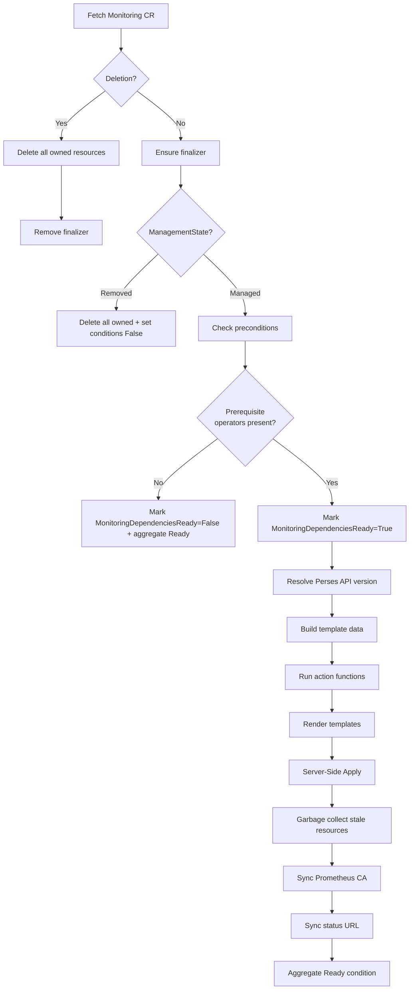
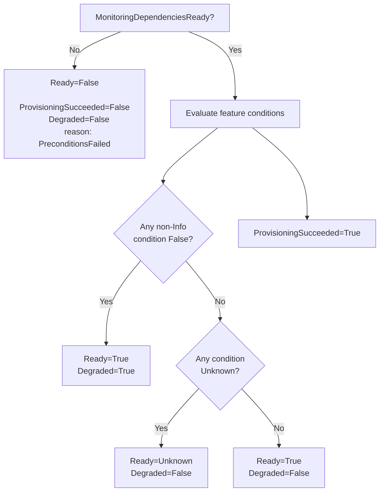

# Architecture

The odh-observability operator is a standalone Kubernetes operator that manages the full observability stack for Open Data Hub and Red Hat OpenShift AI. It reconciles a single cluster-scoped custom resource (`Monitoring`) into a set of operand resources: Prometheus via MonitoringStack, Thanos Querier, OpenTelemetry Collector, Tempo for distributed tracing, Perses dashboards, and a mutating admission webhook for automatic label injection.

**API Group:** `services.platform.opendatahub.io/v1alpha1`
**Kind:** `Monitoring`
**Scope:** Cluster (singleton, name must be `default-monitoring`)

The operator is a modularized extraction from the [opendatahub-operator](https://github.com/opendatahub-io/opendatahub-operator). It is designed to run standalone or be orchestrated by the ODH operator via the ModuleHandler pattern.

## Reconciliation Flow

The controller follows a declarative template-rendering pattern. Each reconcile cycle evaluates the CR spec, determines which features are enabled, collects the appropriate YAML templates, renders them with cluster-aware data, and applies everything atomically via Server-Side Apply.



### Precondition Checks

Before any feature deployment, the reconciler verifies that prerequisite operators are installed by checking OLM OperatorConditions:

| Operator | Required When |
|----------|--------------|
| `cluster-observability-operator` | Metrics configured |
| `tempo-operator` | Traces configured |
| `opentelemetry-operator` | Metrics, traces, or usage logs configured |
| `loki-operator` | Usage logs or cluster log forwarding configured |
| `cluster-logging` | Cluster log forwarding configured |

If any required operator is missing, `MonitoringDependenciesReady` is set to False with the missing operator names and OperatorHub installation guidance. Reconciliation then stops without error (no retry -- the CRD watch will trigger re-reconciliation when operators are installed). The legacy `MonitoringAvailable` condition is updated in parallel for compatibility.

## Action Functions

Action functions run sequentially in a fixed order. Each function checks whether its feature is enabled, verifies required CRDs exist, manages its condition, and appends template sources to a shared collection.

| Order | Function | Spec Trigger | CRDs Checked | Condition | Templates |
|-------|----------|-------------|--------------|-----------|-----------|
| 1 | `deployWebhookInfrastructure` | Always | `Issuer` (cert-manager) | `WebhookAvailable` | webhook-service, webhook-cert-manager, webhook-configuration |
| 2 | `deployMonitoringAdmissionPolicies` | Always | None | None | monitoring-admission-policies |
| 3 | `deployMonitoringStackWithQuerierAndRestrictions` | `spec.metrics` | `MonitoringStack`, `ThanosQuerier` | `MonitoringStackAvailable`, `ThanosQuerierAvailable` | 11 templates (see inventory) |
| 4 | `deployTracingStack` | `spec.traces` | `TempoMonolithic`/`TempoStack`, `Instrumentation` | `TempoAvailable`, `InstrumentationAvailable` | Tempo template + instrumentation |
| 5 | `deployOpenTelemetryCollector` | `spec.metrics` or `spec.traces` | `OpenTelemetryCollector` | `OpenTelemetryCollectorAvailable` | collector, RBAC, ServiceMonitors, Prometheus service |
| 6 | `deployAlerting` | `spec.alerting` | `PrometheusRule` | `AlertingAvailable` | operator-prometheusrules |
| 7 | `deployNodeMetricsEndpoint` | `spec.metrics` | None | `NodeMetricsEndpointAvailable` | prometheus-cluster-proxy |
| 8 | `deployPerses` | `spec.metrics` or `spec.traces` | `Perses` | `PersesAvailable` | perses, network-policy |
| 9 | `deployPersesTempoIntegration` | `spec.traces` | `PersesDatasource`, `PersesDashboard` | `PersesTempoDataSourceAvailable` | datasource, CA ConfigMap, dashboard |
| 10 | `deployPersesPrometheusIntegration` | `spec.metrics` | `PersesDatasource` | `PersesPrometheusDataSourceAvailable` | 2 datasource templates |

When a feature is not configured, the action calls `MarkNotConfigured` (Info severity) which prevents it from contributing to Degraded status. When a required CRD is missing, `MarkFalse` is used, which does contribute to Degraded.

## Resource Inventory

All templates are embedded via `//go:embed` and rendered with Go's `text/template` engine. They are grouped by subsystem below.

### Metrics (MonitoringStack + Thanos Querier)

| Template | Resources Created |
|----------|-------------------|
| `monitoring-stack.tmpl.yaml` | MonitoringStack CR |
| `prometheus-web-tls-service.tmpl.yaml` | Service for Prometheus TLS |
| `prometheus-self-servicemonitor.tmpl.yaml` | ServiceMonitor for self-monitoring |
| `monitoringstack-alertmanager-rbac.tmpl.yaml` | RBAC for Alertmanager |
| `data-science-prometheus-route.tmpl.yaml` | Route for Prometheus access |
| `data-science-prometheus-service-override.tmpl.yaml` | Service override for Prometheus |
| `data-science-prometheus-network-policy.tmpl.yaml` | NetworkPolicy for Prometheus |
| `data-science-prometheus-namespace-proxy.tmpl.yaml` | Namespace-scoped Prometheus proxy |
| `data-science-prometheus-namespace-proxy-network-policy.tmpl.yaml` | NetworkPolicy for namespace proxy |
| `thanos-querier-cr.tmpl.yaml` | ThanosQuerier CR |
| `thanos-querier-route.tmpl.yaml` | Route for Thanos Querier |

### Tracing (Tempo + Instrumentation)

| Template | Resources Created |
|----------|-------------------|
| `tempo-monolithic.tmpl.yaml` | TempoMonolithic CR (PV backend) |
| `tempo-stack.tmpl.yaml` | TempoStack CR (S3/GCS backend) |
| `instrumentation.tmpl.yaml` | Instrumentation CR for auto-instrumentation |
| `tempo-service-ca-configmap.tmpl.yaml` | CA ConfigMap for Tempo TLS |

### OpenTelemetry Collector

| Template | Resources Created |
|----------|-------------------|
| `opentelemetry-collector.tmpl.yaml` | OpenTelemetryCollector CR |
| `collector-rbac.tmpl.yaml` | RBAC for the collector |
| `collector-servicemonitors.tmpl.yaml` | ServiceMonitors for collector metrics |
| `collector-prometheus-service.tmpl.yaml` | Prometheus receiver service |

### Alerting

| Template | Resources Created |
|----------|-------------------|
| `operator-prometheusrules.tmpl.yaml` | PrometheusRule for operator alerts |

### Perses (Dashboards)

| Template | Resources Created |
|----------|-------------------|
| `perses.tmpl.yaml` | Perses CR |
| `perses-operator-access-network-policy.tmpl.yaml` | NetworkPolicy for Perses operator |
| `perses-tempo-datasource.tmpl.yaml` | PersesDatasource for Tempo |
| `perses-tempo-dashboard-v1alpha1.tmpl.yaml` | PersesDashboard (v1alpha1 API) |
| `perses-tempo-dashboard-v1alpha2.tmpl.yaml` | PersesDashboard (v1alpha2 API) |
| `perses-datasource-prometheus.tmpl.yaml` | PersesDatasource for namespace Prometheus |
| `perses-datasource-cluster-prometheus.tmpl.yaml` | PersesDatasource for cluster Prometheus |

### Node Metrics

| Template | Resources Created |
|----------|-------------------|
| `data-science-prometheus-cluster-proxy.tmpl.yaml` | Cluster-wide Prometheus proxy |

### Webhook Infrastructure

| Template | Resources Created |
|----------|-------------------|
| `webhook-service.tmpl.yaml` | Service for webhook endpoint |
| `webhook-cert-manager.tmpl.yaml` | cert-manager Certificate + Issuer |
| `webhook-configuration.tmpl.yaml` | MutatingWebhookConfiguration |

### Admission Policies

| Template | Resources Created |
|----------|-------------------|
| `monitoring-admission-policies.tmpl.yaml` | ValidatingAdmissionPolicy + Binding |

## Condition System

The operator manages 12 feature-specific conditions that aggregate into 3 top-level conditions required by the PlatformObject contract.

### Feature Conditions

Each action function manages one or more conditions:

| Condition | Set By |
|-----------|--------|
| `MonitoringDependenciesReady` | External operator precondition check |
| `MonitoringAvailable` | Legacy alias of `MonitoringDependenciesReady` |
| `MonitoringStackAvailable` | `deployMonitoringStackWithQuerierAndRestrictions` |
| `ThanosQuerierAvailable` | `deployMonitoringStackWithQuerierAndRestrictions` |
| `TempoAvailable` | `deployTracingStack` |
| `InstrumentationAvailable` | `deployTracingStack` |
| `OpenTelemetryCollectorAvailable` | `deployOpenTelemetryCollector` |
| `AlertingAvailable` | `deployAlerting` |
| `PersesAvailable` | `deployPerses` |
| `PersesTempoDataSourceAvailable` | `deployPersesTempoIntegration` |
| `PersesPrometheusDataSourceAvailable` | `deployPersesPrometheusIntegration` |
| `NodeMetricsEndpointAvailable` | `deployNodeMetricsEndpoint` |
| `WebhookAvailable` | `deployWebhookInfrastructure` |

### Condition Severities

The `ConditionsManager` supports three marking methods:

- **`MarkTrue`** -- Feature is available. Status=True, Reason="Available".
- **`MarkFalse`** -- Feature is degraded (e.g. missing CRD). Status=False. Contributes to Degraded=True.
- **`MarkNotConfigured`** -- Feature is not enabled in the spec, or is in a transient bootstrapping state. Status=False, Severity=Info. Excluded from Degraded aggregation.

### Aggregation Logic



The key design decision: unconfigured features (Info severity) do not make the operator appear degraded. Only actual failures -- like a missing CRD for a configured feature -- trigger Degraded=True.

## Template Data Pipeline

The `buildTemplateData()` function transforms the CR spec and cluster state into a flat `map[string]any` that all Go templates consume.

### Data Sources

| Source | Data Produced |
|--------|---------------|
| CR spec | Namespace, feature flags (Metrics/Traces booleans), storage config, TLS config |
| Environment variables | `POD_NAMESPACE`, `OPERATOR_NAME`, `RELATED_IMAGE_*` for operand images |
| Cluster probing | SNO detection (single-node OpenShift), Perses API version (v1alpha1 vs v1alpha2) |
| Defaults | Resource limits, retention periods, sample ratios, storage sizes |

### SNO Awareness

The operator detects single-node OpenShift clusters and adjusts defaults:
- **CollectorReplicas**: 1 on SNO, 2 on multi-node (unless explicitly set in spec)
- **MonitoringStack replicas**: adjusted for SNO constraints

### Exporter Validation

Custom OTel exporters (`spec.metrics.exporters`, `spec.traces.exporters`) go through a validation pipeline:
- Reserved name check (blocks `otlp/tempo`, `prometheus`)
- Component ID regex validation
- Size limits: 10KB per exporter, 50KB total
- YAML security validation: max 50 fields, max 10 nesting depth, max 1024 string length, max 100 array length
- Schema validation for known types: `otlp`, `otlphttp`, `debug`, `prometheusremotewrite`
- Secure endpoint enforcement: blocks insecure HTTP for non-local endpoints

## Mutating Admission Webhook

The operator includes a mutating admission webhook that injects the `opendatahub.io/monitoring=true` label onto `ServiceMonitor` and `PodMonitor` resources (both `monitoring.coreos.com/v1`).

### How It Works

1. A namespace opts in by having the label `opendatahub.io/monitoring=true`.
2. When a ServiceMonitor or PodMonitor is created/updated in an opted-in namespace, the webhook intercepts the request.
3. The webhook verifies the `default-monitoring` CR exists (monitoring is active).
4. If the object does not already have the label, the webhook injects `opendatahub.io/monitoring: "true"` via JSON patch.

This label is what makes the MonitoringStack's Prometheus instance discover and scrape the monitor.

### Self-Bootstrapping

The webhook is self-bootstrapping -- the operator provisions its own TLS infrastructure:

1. The reconciler checks for cert-manager's `Issuer` CRD on the cluster.
2. If present, it deploys a cert-manager Certificate and self-signed Issuer to generate TLS certs.
3. Once the TLS secret is provisioned, the operator patches its own Deployment to add `--enable-webhook=true`, the webhook port (9443), and the cert volume mount.
4. The MutatingWebhookConfiguration is deployed, pointing at the operator's Service.

During bootstrapping, the `WebhookAvailable` condition uses Info severity (`MarkNotConfigured`) so the operator does not appear degraded while waiting for cert-manager to provision certificates.

## Garbage Collection

The operator uses label-based garbage collection to remove resources that are no longer desired.

After each reconcile, `collectGarbage()` compares the set of resources that were just rendered and applied (the "desired" set) against all resources on the cluster labeled with `PlatformPartOf=monitoring` in the target namespace. Any resource in the actual set but not in the desired set is deleted.

This handles scenarios like:
- A feature being deconfigured (e.g. removing `spec.traces` removes all Tempo resources)
- Template changes that rename or remove resources across upgrades
- The `Removed` management state, which triggers `deleteAllOwned()` to remove everything

## Namespace-Scoped Metrics

The operator deploys a two-proxy architecture (`data-science-prometheus-namespace-proxy`) that provides secure, namespace-scoped access to Prometheus metrics.

```
User Request
    |
kube-rbac-proxy (port 8443)
    |-- Authenticates via bearer token (TokenReview)
    |-- Extracts 'namespace' query parameter
    |-- Performs SubjectAccessReview for metrics.k8s.io/pods
    |
prom-label-proxy (port 9091)
    |-- Validates namespace parameter is present
    |-- Rewrites PromQL queries to inject namespace label filter
    |
Prometheus (port 9090)
```

**Authentication**: kube-rbac-proxy validates bearer tokens via Kubernetes TokenReview API.

**Authorization**: SubjectAccessReview checks that the user has permissions for `metrics.k8s.io/pods` in the requested namespace. The verb is derived from the HTTP method (GET -> `get`, POST -> `create`).

**Query isolation**: prom-label-proxy rewrites PromQL queries to inject `{namespace="<value>"}`, ensuring users only see metrics from namespaces they are authorized for, regardless of how they craft their queries.

**Network isolation**: A NetworkPolicy restricts ingress to the OpenShift router and Alertmanager only.

## Controller Setup and Watches

The controller watches multiple resource types to detect drift and react to cluster changes:

| Watch Target | Purpose |
|-------------|---------|
| `Monitoring` CR | Primary reconcile trigger |
| Managed resources (Deployment, Service, ConfigMap, Secret, Role, RoleBinding, ClusterRole, ClusterRoleBinding, NetworkPolicy, Job, ServiceAccount, Route) | Drift detection -- re-reconciles if labeled resources are modified |
| `CustomResourceDefinition` | Reacts when optional operators (COO, Tempo, OTel, Perses, cert-manager) are installed or removed |

All managed resource watches use a label predicate (`PlatformPartOf=monitoring`) and a singleton handler that always enqueues `{Name: "default-monitoring"}`.
